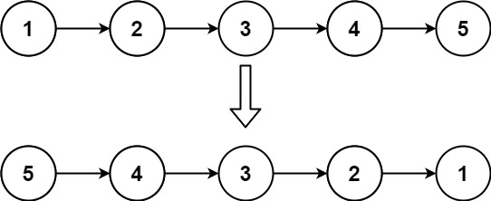
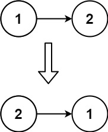

# [206. 反转链表](https://leetcode.cn/problems/reverse-linked-list/description/?envType=company&envId=bytedance&favoriteSlug=bytedance-thirty-days)

给你单链表的头节点 head ，请你反转链表，并返回反转后的链表。

>示例 1：<br>
 <br>
输入：head = [1,2,3,4,5] <br>
输出：[5,4,3,2,1]

>示例 2：<br>
 <br>
输入：head = [1,2] <br>
输出：[2,1]

>示例 3：<br>
输入：head = [] <br>
输出：[]

提示：<br>
链表中节点的数目范围是 [0, 5000] <br>
-5000 <= Node.val <= 5000

进阶：链表可以选用迭代或递归方式完成反转。你能否用两种方法解决这道题？

# 解题思路
遍历链表，头插法反转

# code
```java
/**
 * Definition for singly-linked list.
 * public class ListNode {
 *     int val;
 *     ListNode next;
 *     ListNode() {}
 *     ListNode(int val) { this.val = val; }
 *     ListNode(int val, ListNode next) { this.val = val; this.next = next; }
 * }
 */
class Solution {
    public ListNode reverseList(ListNode head) {
        // corner case
        if (head == null || head.next == null) {
            return head;
        }

        ListNode dummy = new ListNode();
        dummy.next = head;

        ListNode curr = head;
        while (curr != null && curr.next != null) {
            ListNode next = curr.next;

            curr.next = next.next;
            next.next = dummy.next;
            dummy.next = next;
        }

        return dummy.next;
    }
}
```