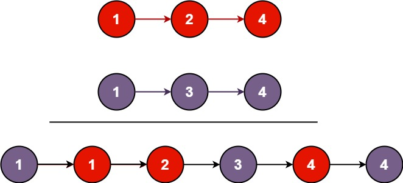

# [21. 合并两个有序链表](https://leetcode.cn/problems/merge-two-sorted-lists/description/?envType=company&envId=bytedance&favoriteSlug=bytedance-thirty-days)

将两个升序链表合并为一个新的 升序 链表并返回。新链表是通过拼接给定的两个链表的所有节点组成的。 

>示例 1：<br>

>输入：l1 = [1,2,4], l2 = [1,3,4]<br>
输出：[1,1,2,3,4,4]

>示例 2：<br>
输入：l1 = [], l2 = [] <br>
输出：[]

>示例 3：<br>
输入：l1 = [], l2 = [0]<br>
输出：[0]
 
提示：<br>
两个链表的节点数目范围是 [0, 50]<br>
-100 <= Node.val <= 100<br>
l1 和 l2 均按 非递减顺序 排列

# 解题思路
遍历就行了，谁小就先把谁接上

# code
```java
/**
 * Definition for singly-linked list.
 * public class ListNode {
 *     int val;
 *     ListNode next;
 *     ListNode() {}
 *     ListNode(int val) { this.val = val; }
 *     ListNode(int val, ListNode next) { this.val = val; this.next = next; }
 * }
 */
class Solution {
    public ListNode mergeTwoLists(ListNode list1, ListNode list2) {
        // corner case
        if (list1 == null) {
            return list2;
        }

        if (list2 == null) {
            return list1;
        }

        // 结果链表
        ListNode dummy = new ListNode();
        ListNode pointer = dummy;

        // 遍历
        while (list1 != null && list2 != null) {
            if (list1.val < list2.val) {
                pointer.next = list1;
                list1 = list1.next;
            } else {
                pointer.next = list2;
                list2 = list2.next;
            }

            pointer = pointer.next;
        }

        if (list1 != null) {
            pointer.next = list1;
        }

        if (list2 != null) {
            pointer.next = list2;
        }

        return dummy.next;
    }
}
```