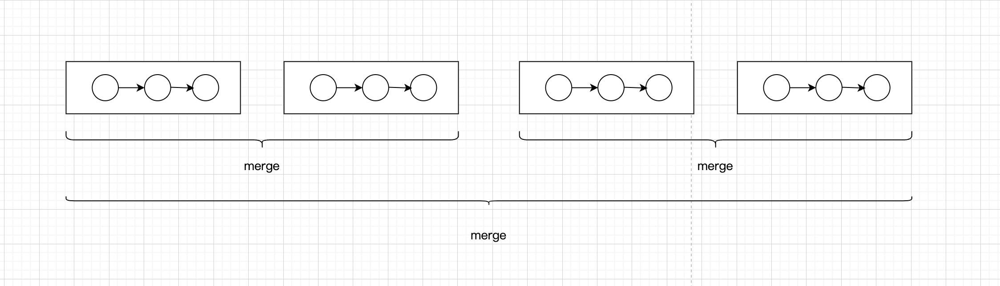

# [23. 合并k个升序列表](https://leetcode.cn/problems/merge-k-sorted-lists/description/?envType=company&envId=bytedance&favoriteSlug=bytedance-thirty-days)

给你一个链表数组，每个链表都已经按升序排列。<br>
请你将所有链表合并到一个升序链表中，返回合并后的链表。

>示例 1：<br>
输入：lists = [[1,4,5],[1,3,4],[2,6]]<br>
输出：[1,1,2,3,4,4,5,6]<br>
解释：链表数组如下：<br>
[<br>
  1->4->5,<br>
  1->3->4,<br>
  2->6<br>
]<br>
将它们合并到一个有序链表中得到。<br>
1->1->2->3->4->4->5->6

>示例 2：<br>
输入：lists = []<br>
输出：[]

>示例 3：<br>
输入：lists = [[]]<br>
输出：[]
 

提示：<br>
k == lists.length<br>
0 <= k <= 10^4<br>
0 <= lists[i].length <= 500<br>
-10^4 <= lists[i][j] <= 10^4<br>
lists[i] 按 升序 排列<br>
lists[i].length 的总和不超过 10^4

# 解题思路
递归，分治



总的拆成两边，各自merge，最后把两边总的结果merge

两边也是分别按这个逻辑拆，最后直到拆倒一组里有两个链表，mergeTwoListNode即可

# code
```java
class Solution {
    public ListNode mergeKLists(ListNode[] lists) {
        // corner case
        if (lists == null || lists.length == 0) {
            return null;
        } 

        if (lists.length == 1) {
            return lists[0];
        }

        return doMerge(lists, 0, lists.length - 1);
    }

    private ListNode doMerge(ListNode[] lists, int start, int end) {
        if (start == end) {
            return lists[start];
        }

        int mid = start + (end - start) / 2;
        ListNode left = doMerge(lists, start, mid);
        ListNode right = doMerge(lists, mid + 1, end);

        return mergeTwoList(left, right);
    }

    private ListNode mergeTwoList(ListNode left, ListNode right) {
        ListNode dummy = new ListNode();
        ListNode pointer = dummy;

        while (left != null && right != null) {
            int newNodeValue = 0;
            if (left.val < right.val) {
                newNodeValue = left.val;
                left = left.next;
            } else {
                newNodeValue = right.val;
                right = right.next;
            }

            pointer.next = new ListNode(newNodeValue);
            pointer = pointer.next;
        }

        pointer.next = left != null ? left : right;

        return dummy.next;
    }
}
```