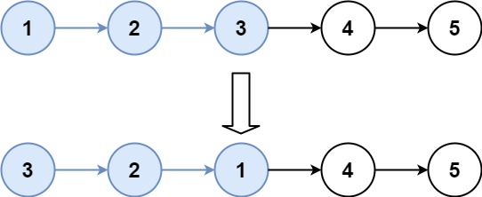

# [k个一组翻转链表](https://leetcode.cn/problems/reverse-nodes-in-k-group/description/?envType=company&envId=bytedance&favoriteSlug=bytedance-thirty-days)

给你链表的头节点 `head`，每 `k` 个节点一组进行翻转，请你返回修改后的链表。

`k` 是一个正整数，它的值小于或等于链表的长度。如果节点总数不是 k 的整数倍，那么请将最后剩余的节点保持原有顺序。

你不能只是单纯的改变节点内部的值，而是需要实际进行节点交换。

>示例 1：<br>

>输入：head = [1,2,3,4,5], k = 2<br>
输出：[2,1,4,3,5]

>示例 2：<br>

>输入：head = [1,2,3,4,5], k = 3<br>
输出：[3,2,1,4,5]
 

提示：<br>
链表中的节点数目为 n <br>
1 <= k <= n <= 5000 <br>
0 <= Node.val <= 1000

进阶：你可以设计一个只用 O(1) 额外内存空间的算法解决此问题吗？

# 解题思路
总体思路：
- 记录一个子链表头
- 数count个，到达子链表尾
- 断开子链表
- 翻转子链表
- 接回去（需要知道子链表前面一个节点，和后面一个节点）


所以每次循环，需要如下几个数据：
- pre：子链表前面一个节点
- next：子链表后面一个节点
- head：子链表头节点
- tail：子链表尾节点

注意：
- 当不足count数个元素时，不用操作

# code
```java
/**
 * Definition for singly-linked list.
 * public class ListNode {
 *     int val;
 *     ListNode next;
 *     ListNode() {}
 *     ListNode(int val) { this.val = val; }
 *     ListNode(int val, ListNode next) { this.val = val; this.next = next; }
 * }
 */
class Solution {
    public ListNode reverseKGroup(ListNode head, int k) {
        // corner case
        if (head == null || k <= 1) {
            return head;
        }

        // 先整个dummy，日后好相见
        ListNode dummy = new ListNode();
        dummy.next = head;

        // 整那四个节点：pre, 
        ListNode pre = dummy;
        ListNode subHead = head;
        ListNode subTail = head;
        ListNode next;

        while (subHead != null) {
            // 找subtail
            int count = 1;
            while (subTail != null && count < k) {
                subTail = subTail.next;
                count++;
            }

            // 如果此时subTail为null，说敏子链表个数不足k个
            if (subTail == null) {
                break;
            }

            next = subTail.next;

            // 断开子链表
            pre.next = null;
            subTail.next = null;

            // 翻转子链表
            ListNode[] reversedListNodes = reverse(subHead, subTail);

            // 重新连接
            pre.next = reversedListNodes[0];
            reversedListNodes[1].next = next;

            // 更新pre,subHead, subTail
            pre = reversedListNodes[1];
            subHead = next;
            subTail = next;
        }
        
        return dummy.next;
    }

    private ListNode[] reverse(ListNode head, ListNode tail) {
        ListNode dummy = new ListNode();
        dummy.next = head;

        ListNode currNode = head;
        while (currNode != null && currNode.next != null) {
            ListNode next = currNode.next;
            
            // 头插法
            currNode.next = next.next;
            next.next = dummy.next;
            dummy.next = next;

            next = currNode.next;
        }

        return new ListNode[]{dummy.next, currNode};
    }
}
```