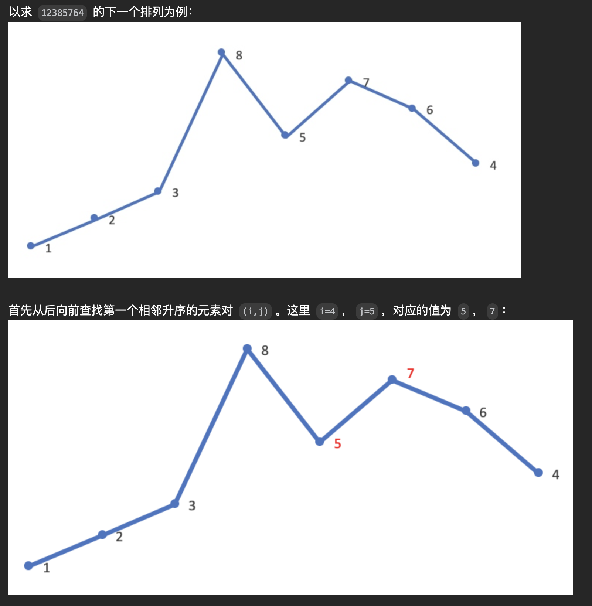
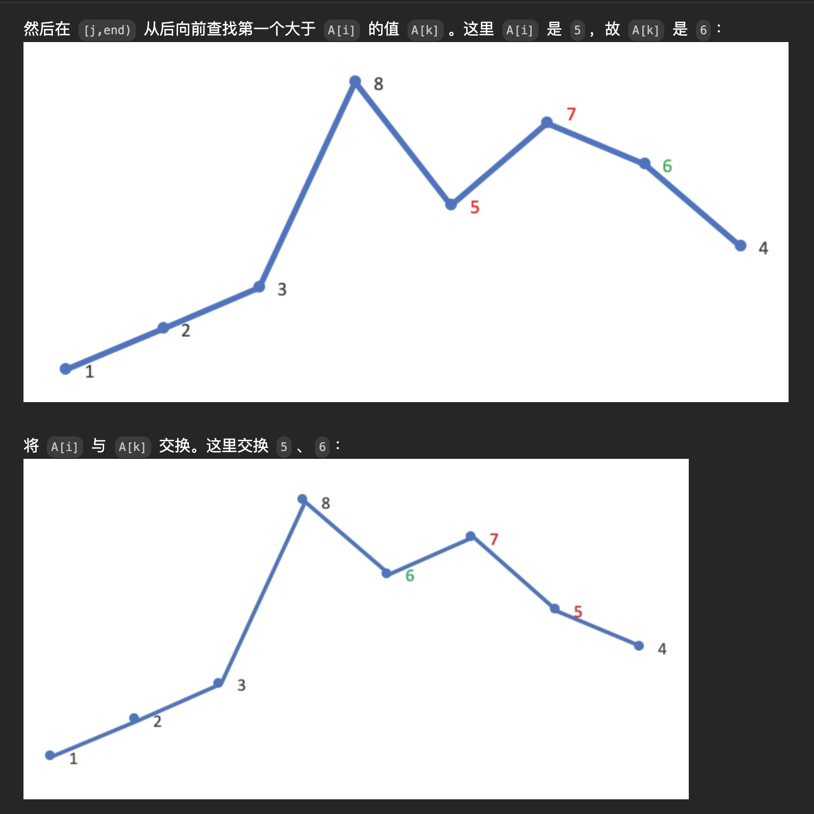
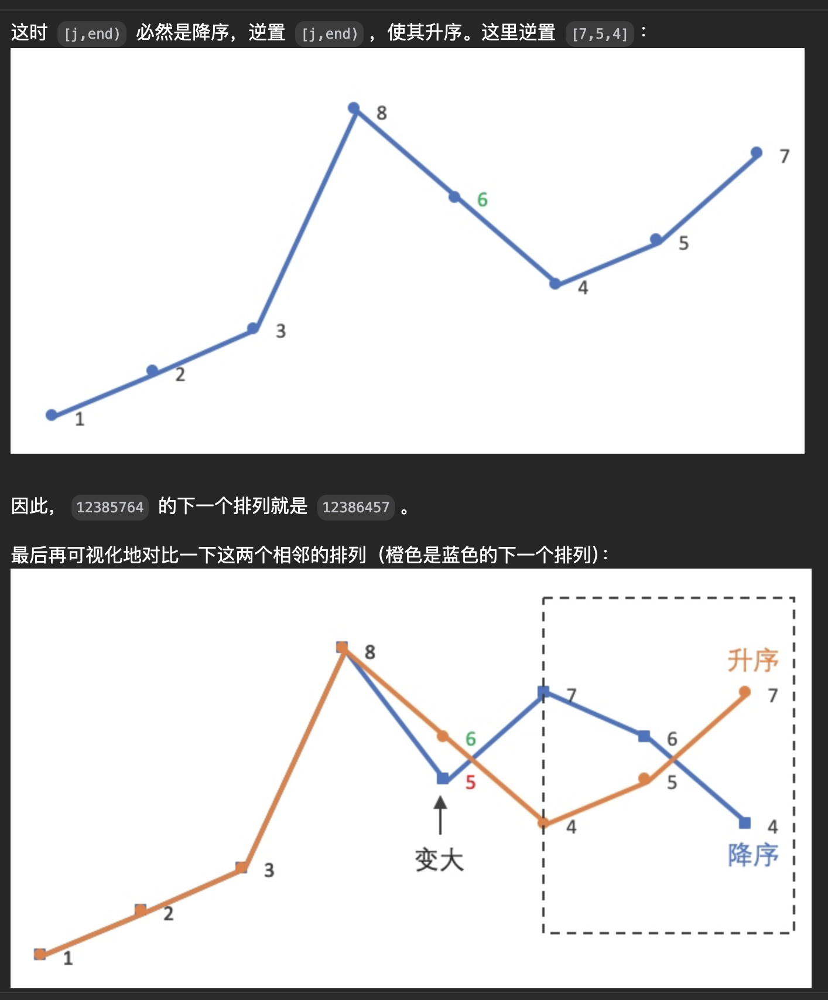

# [31. 下一个排列](https://leetcode.cn/problems/next-permutation/description/?envType=company&envId=bytedance&favoriteSlug=bytedance-thirty-days)

整数数组的一个 排列  就是将其所有成员以序列或线性顺序排列。

- 例如，`arr = [1,2,3]` ，以下这些都可以视作 arr 的排列：`[1,2,3]`、`[1,3,2]`、`[3,1,2]`、`[2,3,1]` 。<br>

整数数组的 下一个排列 是指其整数的下一个字典序更大的排列。更正式地，如果数组的所有排列根据其字典顺序从小到大排列在一个容器中，那么数组的 下一个排列 就是在这个有序容器中排在它后面的那个排列。如果不存在下一个更大的排列，那么这个数组必须重排为字典序最小的排列（即，其元素按升序排列）。

- 例如，arr = `[1,2,3]` 的下一个排列是 `[1,3,2]` 。
- 类似地，arr = `[2,3,1]` 的下一个排列是 `[3,1,2]` 。
- 而 arr = `[3,2,1]` 的下一个排列是 `[1,2,3]` ，因为 `[3,2,1]` 不存在一个字典序更大的排列。

给你一个整数数组 `nums` ，找出 `nums` 的下一个排列。

必须 原地 修改，只允许使用额外常数空间。

 
>示例 1：<br>
输入：nums = [1,2,3]<br>
输出：[1,3,2]

>示例 2：<br>
输入：nums = [3,2,1]<br>
输出：[1,2,3]

>示例 3：<br>
输入：nums = [1,1,5]<br>
输出：[1,5,1]

提示：<br>
1 <= nums.length <= 100<br>
0 <= nums[i] <= 100

# 解题思路
[推荐这篇优雅的题解](https://leetcode.cn/problems/next-permutation/solutions/80560/xia-yi-ge-pai-lie-suan-fa-xiang-jie-si-lu-tui-dao-)

1. 从后向前，找到第一个升序元素对，假设对应位置是(i, j)，对应值是(5, 7)
2. 从后向前，找到第一个>5的数，假设对应位置k
3. swap(i, k)
4. 倒置(j, end)

图解：




# code
```java
// 1. 从后向前，找到第一个升序元素对，假设对应位置是(i, j)，对应值是(5, 7)
// 2. 从后向前，找到第一个>5的数，假设对应位置k
// 3. swap(i, k)
// 4. 倒置(j, end)
class Solution {
    public void nextPermutation(int[] nums) {
        // corner case
        if (nums == null || nums.length == 0) {
            return;
        }

        // 从后往前，找到第一个升序元素对
        int lowerIndex = -1;
        for (int i = nums.length - 2; i >= 0; i--) {
            if (nums[i] < nums[i + 1]) {
                lowerIndex = i;
                break;
            }
        }

        // 如果全数组降序，那么这就是最大的值了，直接倒置整个数组即为结果
        if (lowerIndex == -1) {
            reverse(nums, 0, nums.length - 1);
            return;
        }

        // 从后往前找第一个大于nums[lowerIndex]的位置
        int higherIndex = -1;
        for (int i = nums.length - 1; i > lowerIndex; i--) {
            if (nums[i] > nums[lowerIndex]) {
                higherIndex = i;
                break;
            }
        }

        if (higherIndex == -1) {
            // error
            return;
        }

        // swap nums lowerIndex, higherIndex
        swap(nums, lowerIndex, higherIndex);

        // reverse [lowerIndex + 1, end]
        reverse(nums, lowerIndex + 1, nums.length - 1);
        return;
    }

    private void reverse(int[] nums, int startIndex, int endIndex) {
        while (startIndex < endIndex) {
            swap(nums, startIndex, endIndex);
            startIndex++;
            endIndex--;
        }
    }

    private void swap(int[] nums, int left, int right) {
        int temp = nums[left];
        nums[left] = nums[right];
        nums[right] = temp;
    }
}
```