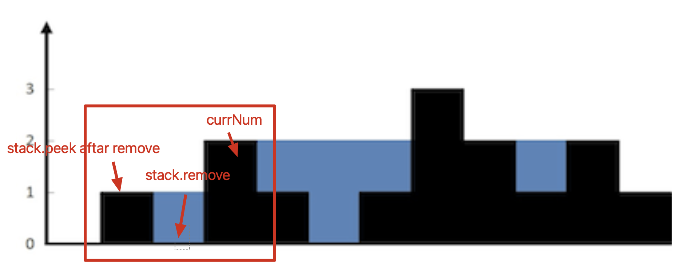

# [接雨水](https://leetcode.cn/problems/trapping-rain-water/description/?envType=company&envId=bytedance&favoriteSlug=bytedance-thirty-days)

给定 n 个非负整数表示每个宽度为 1 的柱子的高度图，计算按此排列的柱子，下雨之后能接多少雨水。

示例 1：


> 输入：height = [0,1,0,2,1,0,1,3,2,1,2,1]<br>
>输出：6<br>
>解释：上面是由数组 [0,1,0,2,1,0,1,3,2,1,2,1] 表示的高度图，在这种情况下，可以接 6 个单位的雨水（蓝色部分表示雨水）。 

示例 2：

>输入：height = [4,2,0,3,2,5]<br>
输出：9
 

>提示：<br>
n == height.length<br>
1 <= n <= 2 * 104<br>
0 <= height[i] <= 105


# 解题思路

维护一个stack，从左向右遍历数组<br>

对比`stack.peek` vs `currNum`
1. stack.isEmpty() -> add to stack
2. 遇到更小的元素，stack.peek > currNum -> 坡 -> add to stack
3. 遇到更大（或相等）的元素（stack.peek <= currNum） -> 形成凹陷 -> 注水
   1. 我们现在有三个元素
      1. 中：stack.remove
      2. 左：stack.peek
      3. 右：currNum
        

    2. 注水：
       1. height = min(左, 右) - 中
       2. width = 右index - 左index - 1 
    3. add(currNum) to stack 作为下一个左边的墙

stack中记录的元素：index, h -> 记录index就可以了，h可以用height[index]

# code
```java
class Solution {
    int result;
    public int trap(int[] height) {
        // corner case
        if (height == null || height.length <= 1) {
            return 0;
        }

        // stack
        Deque<Integer> stack = new ArrayDeque<>();
        // int result = 0;
        for (int i = 0; i < height.length; i++) {
            // 取到元素
            int currHeight = height[i];

            // 决策是放入stack，还是注水
            if (stack.isEmpty()) {
                stack.addLast(i);
                continue;
            }

            int stackPeekHeight = height[stack.peekLast()];
            if (stackPeekHeight > currHeight) {
                stack.addLast(i);
                continue;
            }

            // trapWater
            trapWater(height, stack, i);
        }

        return result;
    }

    private void trapWater(int[] height, Deque<Integer> stack, int rightIndex) {
        // 注意：这里while循环把stack中所有满足条件的都整出来
        while (!stack.isEmpty() && height[stack.peekLast()] <=  height[rightIndex]) {
            int middleIndex = stack.removeLast();

            // 注意：corner case，如果此时stack空了，没有左边的墙了，没法trap
            if (stack.isEmpty()) {
                stack.addLast(rightIndex);
                break;
            }

            int leftIndex = stack.peekLast();
            int trapWidth = rightIndex - leftIndex - 1;
            int trapHeight = Math.min(height[leftIndex], height[rightIndex]) - height[middleIndex];

            result += trapWidth * trapHeight;
        }

        // put i into stack anyway
        stack.addLast(rightIndex);
    }
}
```
