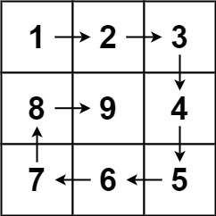

# [59. 螺旋矩阵II](https://leetcode.cn/problems/spiral-matrix-ii/description/?envType=company&envId=bytedance&favoriteSlug=bytedance-thirty-days)

给你一个正整数 `n` ，生成一个包含 `1` 到 `n^2` 所有元素，且元素按顺时针顺序螺旋排列的 n x n 正方形矩阵 matrix 。

>示例 1：<br>
<br>
输入：n = 3 <br>
输出：[[1,2,3],[8,9,4],[7,6,5]] <br>

>示例 2：<br>
输入：n = 1 <br>
输出：[[1]]
 

提示：<br>
1 <= n <= 20

# 解题思路
模拟操作吧就，顺序就是：右 下 左 上
我们需要确定：有边界、下边界、左边界、上边界

完成从左到右的一行：
```java
for(int i = 左边界; i <= 右边界; i++) {
    nums[当前执行行][i] = 要填入的数字
    要填入的数字++
}
更新上边界：上边界++
```

完成从上到下的一列：
```java
for (int i = 上边界; i <= 下边界; i++) {
    nums[i][当前执行的列] = 要填入的数字
    要填入的数字++
}
更新右边界：右边界--
```

完成从右到左的一行：
```java
for (int i = 右边界; i >= 左边界; i--) {
    nums[当前执行行][i] = 要填入的数字
    要填入的数字++
}
更新下边界：下边界--
```
完成从下到上的一列：
```java
for (int i = 下边界; i >= 上边界; i--) {
    nums[i][当前执行的列] = 要填入的数字
    要填入的数字++
}
更新左边界：左边界++
```

# code
```java
class Solution {
    public int[][] generateMatrix(int n) {
        // corner case
        if (n == 0) {
            return new int[0][];
        }

        int[][] result = new int[n][n];
        int upperBound = 0;
        int rightBound = n - 1;
        int lowerBound = n - 1;
        int leftBound = 0;

        int currNum = 1;
        while (currNum <= n * n) {
            // 向右走
            for (int i = leftBound; i <= rightBound; i++) {
                result[upperBound][i] = currNum;
                currNum++;
                if (currNum > n * n) {
                    break;
                }
            }
            upperBound++;

            // 向下走
            for (int i = upperBound; i <= lowerBound; i++) {
                result[i][rightBound] = currNum;
                currNum++;
                if (currNum > n * n) {
                    break;
                }
            }
            rightBound--;

            // 往左走
            for (int i = rightBound; i >= leftBound; i--) {
                result[lowerBound][i] = currNum;
                currNum++;
                if (currNum > n * n) {
                    break;
                }
            }
            lowerBound--;

            // 向上走
            for (int i = lowerBound; i >= upperBound; i--) {
                result[i][leftBound] = currNum;
                currNum++;
                if (currNum > n * n) {
                    break;
                }
            }
            leftBound++;
        }

        return result;
    }
}
```