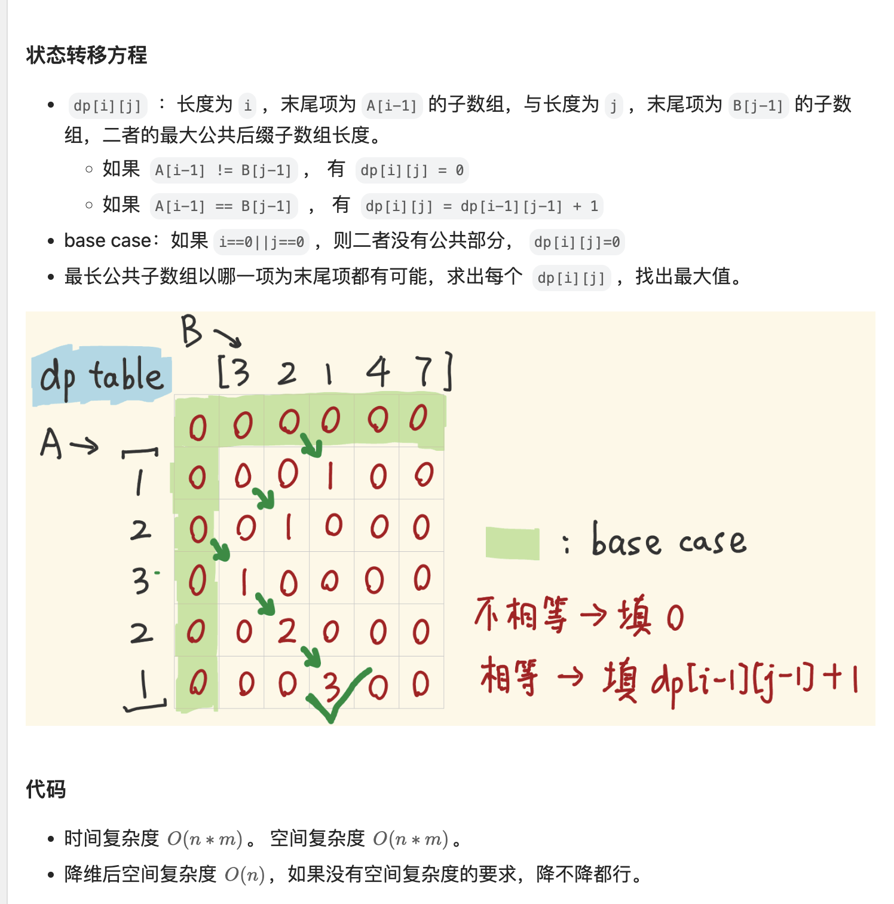
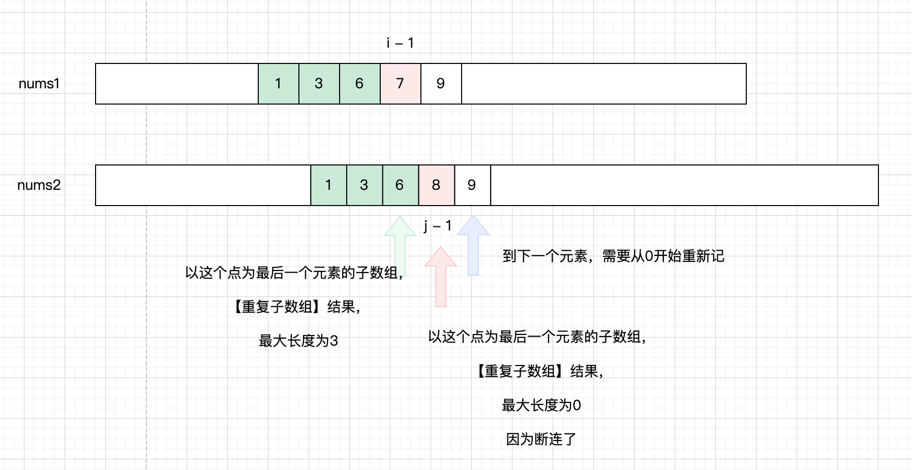
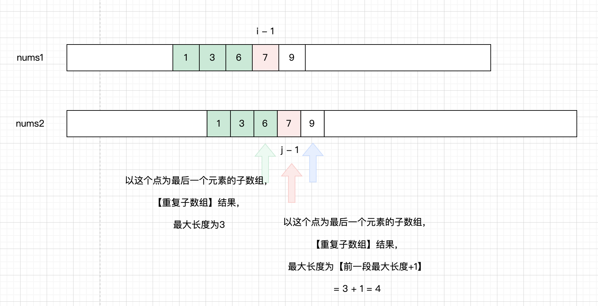
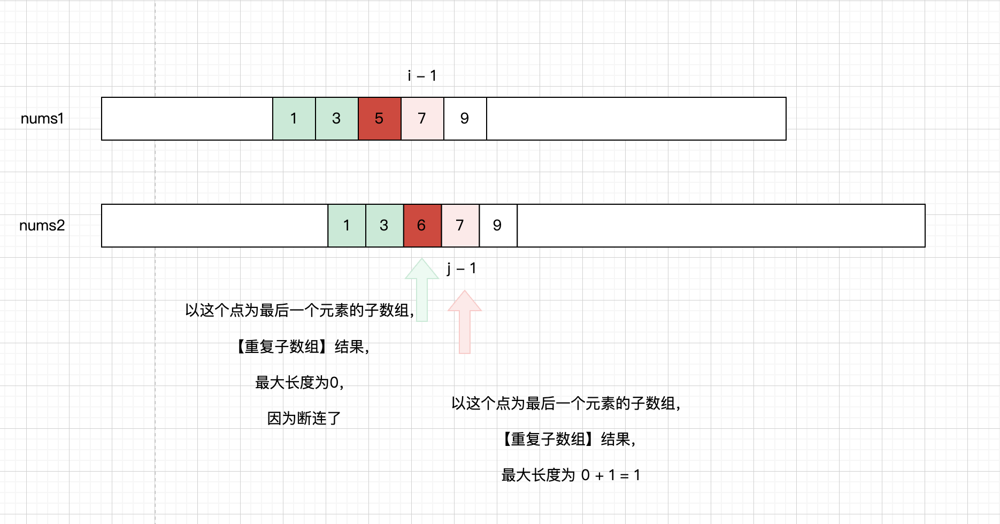
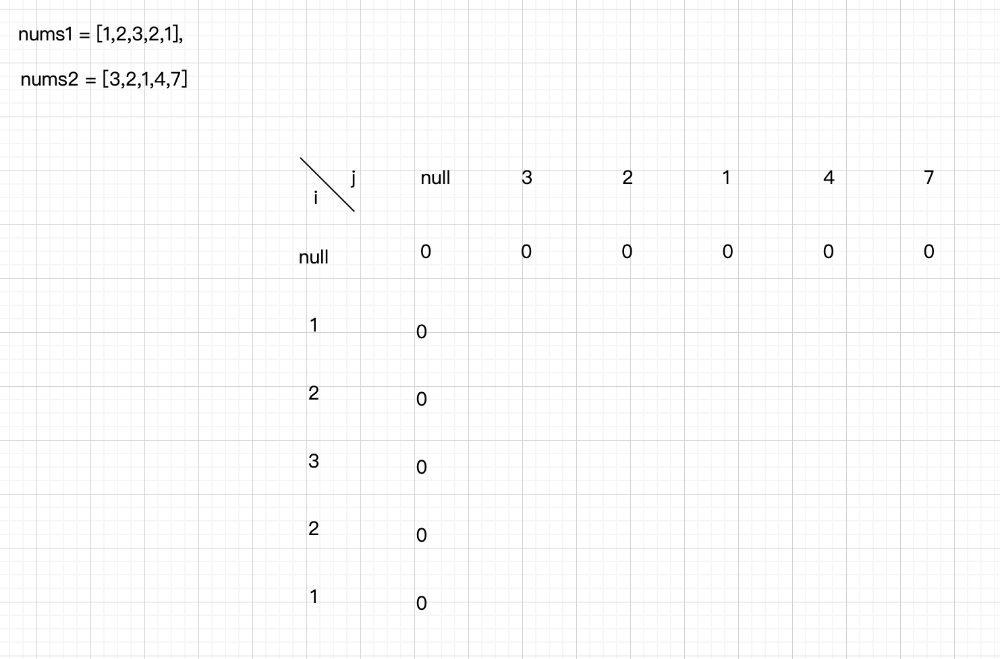
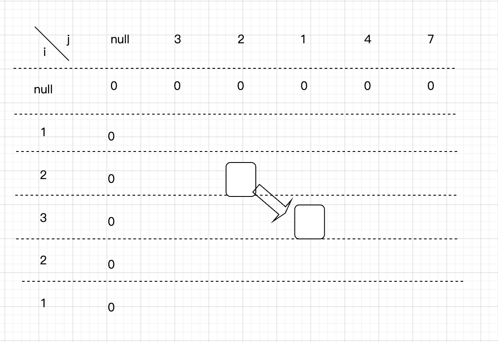
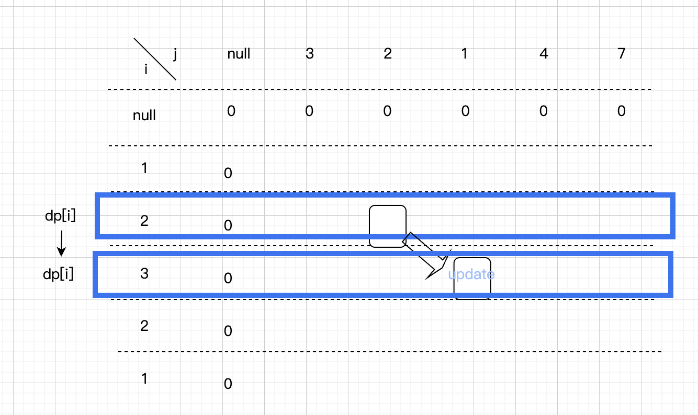

# [718. 最长重复子数组](https://leetcode.cn/problems/maximum-length-of-repeated-subarray/description/?envType=company&envId=bytedance&favoriteSlug=bytedance-thirty-days)

给两个整数数组 nums1 和 nums2 ，返回 两个数组中 公共的 、长度最长的子数组的长度 。


>示例 1：<br>
输入：nums1 = [1,2,3,2,1], nums2 = [3,2,1,4,7]<br>
输出：3<br>
解释：长度最长的公共子数组是 [3,2,1] 。

>示例 2：<br>
输入：nums1 = [0,0,0,0,0], nums2 = [0,0,0,0,0]<br>
输出：5
 

提示：<br>
1 <= nums1.length, nums2.length <= 1000<br>
0 <= nums1[i], nums2[i] <= 100

# 解题思路
最值问题 + 可以大问题拆小问题 -> 动态规划

借用[leetcode题解](https://leetcode.cn/problems/maximum-length-of-repeated-subarray/solutions/310509/zhe-yao-jie-shi-ken-ding-jiu-dong-liao-by-hyj8)配图：


dp[i][j] : 
    - nums1数组中，以index=i-1为结尾的，所有可能子数组
    - nums2数组中，以index=j-1为结尾的，所有可能子数组
    - 上述两种子数组，必须包含末位的情况下，最大公共子数组长度





递推公式：<br>
```java
    if (A[i-1] != B[j-1])
        dp[i][j] = 0
    
    else 
        dp[i-1][j-1] + 1
```

初始化：


其实我觉得不补充空行也是一样的

# code
```java
class Solution {
    public int findLength(int[] nums1, int[] nums2) {
        // corner case
        if (nums1 == null || nums2 == null || nums1.length == 0 || nums2.length == 0) {
            return 0;
        }

        // dp[i][j]表示，【nums1中以i-1位为最后一位的子数组】 与 【nums2中以j-1位为最后一位的子数组】，在重复子数组必须包含最后一位的情况下，所能构成的【最长重复子数组】的长度
        int[][] dp = new int[nums1.length + 1][nums2.length + 1];

        // 初始化dp
        for (int i = 0; i < dp.length; i++) {
            dp[i][0] = 0;
        }

        for (int j = 0; j < dp[0].length; j++) {
            dp[0][j] = 0;
        }

        // 用一个int记录battle结果
        int result = Integer.MIN_VALUE;

        // 递推
        for (int i = 1; i < dp.length; i++) {
            for (int j = 1; j < dp[0].length; j++) {
                if (nums1[i - 1] != nums2[j - 1]) {
                    dp[i][j] = 0;
                } else {
                    dp[i][j] = dp[i - 1][j - 1] + 1;
                    result = Math.max(result, dp[i][j]);
                }
            }
        }

        return result == Integer.MIN_VALUE ? 0 : result;
    }
}
```

# 进阶：滚动数组优化空间复杂度
根据前面的递推公式：
```java
    if (A[i-1] != B[j-1])
        dp[i][j] = 0
    
    else 
        dp[i-1][j-1] + 1
```
发现dp[i][j]只与dp[i-1][j-1]有关<br>
那我们其实不需要下图这么多行、列


例如上图的情况，我只需要把i=2这行当一个一维数组。到i=3这样就从右往左对这个一维数组的元素进行替换

就像是一个一维数组，一行一行的往下卷积

就可以了


```java
class Solution {
    public int findLength(int[] nums1, int[] nums2) {
        // corner case
        if (nums1 == null || nums2 == null || nums1.length == 0 || nums2.length == 0) {
            return 0;
        }

        // 定义dp数组
        int[] dp = new int[nums2.length + 1];

        // 初始化可以略过，因为反正都是初始化为0

        // 递推
        int result = Integer.MIN_VALUE;
        // 从第0行开始往下卷
        for (int i = 1; i < nums1.length + 1; i++) {
            // 对于每一行，从dp[]最后一个元素开始更新
            for (int j = dp.length - 1; j >= 1; j--) {
                if (nums1[i - 1] != nums2[j - 1]) {
                    dp[j] = 0;
                } else {
                    dp[j] = dp[j - 1] + 1;
                    result = Math.max(result, dp[j]);
                }
            }
        }

        return result == Integer.MIN_VALUE ? 0 : result;
    }
}
```