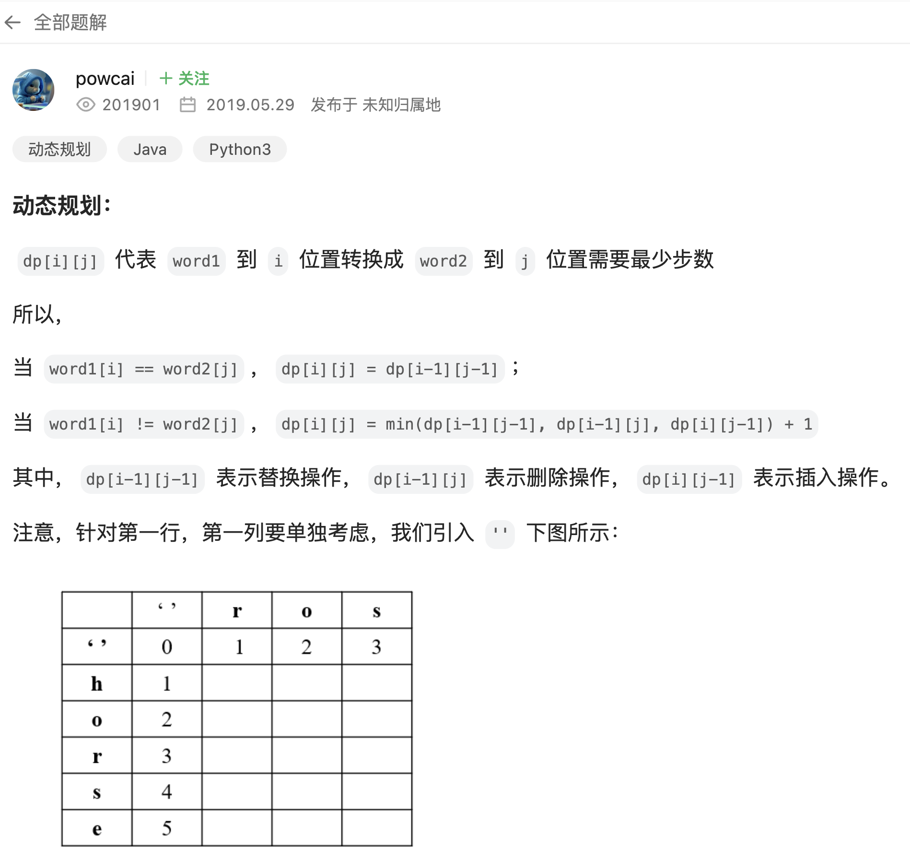
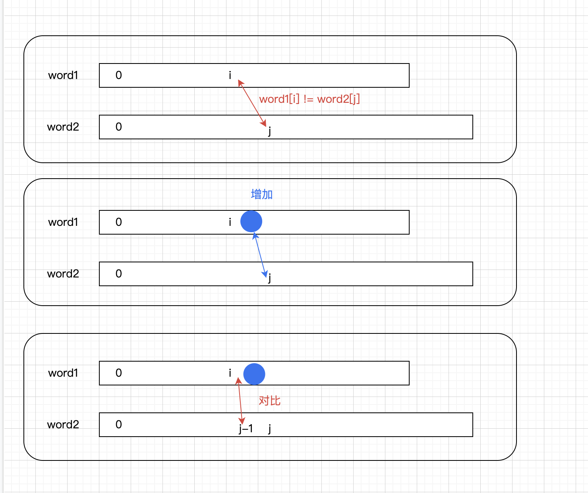

# [72. 编辑距离](https://leetcode.cn/problems/edit-distance/description/?envType=company&envId=bytedance&favoriteSlug=bytedance-thirty-days)

给你两个单词 word1 和 word2， 请返回将 word1 转换成 word2 所使用的最少操作数。

你可以对一个单词进行如下三种操作：
- 插入一个字符
- 删除一个字符
- 替换一个字符
 

>示例 1：<br>
输入：word1 = "horse", word2 = "ros"<br>
输出：3<br>
解释：<br>
horse -> rorse (将 'h' 替换为 'r')<br>
rorse -> rose (删除 'r')<br>
rose -> ros (删除 'e')

>示例 2：<br>
输入：word1 = "intention", word2 = "execution"<br>
输出：5<br>
解释：<br>
intention -> inention (删除 't')<br>
inention -> enention (将 'i' 替换为 'e')<br>
enention -> exention (将 'n' 替换为 'x')<br>
exention -> exection (将 'n' 替换为 'c')<br>
exection -> execution (插入 'u')
 

>提示：<br>
0 <= word1.length, word2.length <= 500<br>
word1 和 word2 由小写英文字母组成

# 解题思路
为什么想到用dp?<br>
    - 不知道，想不到，天王老子来了也想不到，爱咋咋地吧<br>
    - 要不就是看到【最少】，求最值+没有思路 -> 看看能不能拆成子问题，能就试试dp吧（麻了）<br>

leetcode题解里面的这条非常清楚了属于是：


以增加为例，图示一下：


# code
```java
class Solution {
    public int minDistance(String word1, String word2) {
        // corner case
        if (word1 == null || word2 == null) {
            return 0;
        }

        if (word1.length() == 0) {
            return word2.length();
        }

        if (word2.length() == 0) {
            return word1.length();
        }

        // dp[i][j]表示word1.substring(0, i + 1)，变成word2.substring(0, j + 1)，需要的最少操作数
        // dp数组的长度：因为要填充一个“”，所以是word.length() + 1
        int[][] dp = new int[word1.length() + 1][word2.length() + 1];

        // 初始化dp数组
        for (int i = 0; i < word1.length() + 1; i++) {
            dp[i][0] = i;
        }

        for (int j = 0; j < word2.length() + 1; j++) {
            dp[0][j] = j;
        }

        // 根据地推公式，填充dp数组
        // 遍历是从前向后遍历，因为根据递推公式，得到dp[i][j]需要i-1, j-1格子对应的值
        // 操作word的思路是从后往前，从最后一个char往前尝试操作
        for (int i = 1; i < dp.length; i++) {
            for (int j = 1; j < dp[0].length; j++) {
                // 如果i和j位置元素相同 -> dp[i][j] = dp[i - 1][j - 1]
                // 如果不同 ->
                //      word1增加元素 -> dp[i][j] = dp[i][j - 1] + 1
                //      word1删除元素 -> dp[i][j] = dp[i - 1][j] + 1
                //      word1替换元素 -> dp[i][j] = dp[i - 1][j - 1] + 1
                if (word1.charAt(i - 1) == word2.charAt(j - 1)) {
                    dp[i][j] = dp[i - 1][j - 1];
                } else {
                    dp[i][j] = Math.min(dp[i][j - 1], Math.min(dp[i - 1][j], dp[i - 1][j - 1])) + 1;
                }
            }
        }

        // 需要的结果是表格右下角dp[word1.length()][word2.length()]
        return dp[word1.length()][word2.length()];
    }
}
```